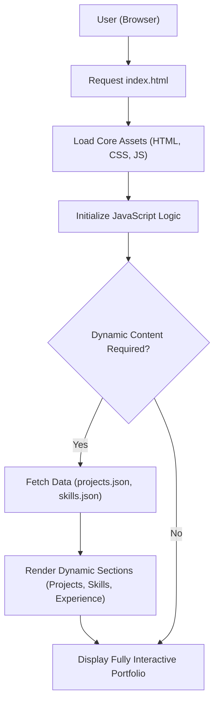

# 🚀 Shreya P's Professional Portfolio

<p align="center"></p>

## Short Description
Welcome to Shreya P's Professional Portfolio – a meticulously crafted, dynamic web experience showcasing a developer's journey, skills, projects, and professional experience. This responsive, modern portfolio is designed to leave a lasting impression, providing an engaging and interactive overview of capabilities and achievements. Built with a focus on clean design and robust front-end technologies, it's the ultimate digital resume for discerning recruiters and collaborators.

## ✨ Key Features
*   **Immersive User Interface**: Engage visitors with a modern, clean, and highly interactive design.
*   **Dynamic Project Showcase**: Explore a curated collection of projects, each detailed with insights and accessible via `projects/projects.json`.
*   **Comprehensive Skillset Display**: A dedicated section to highlight technical proficiencies and tools, powered by `skills.json`.
*   **Detailed Experience Timeline**: Chart professional growth and contributions through an elegant experience section.
*   **Downloadable Resume**: Access a readily available professional resume (`assests/resume.pdf`) for quick review.
*   **Responsive & Performance-Optimized**: Flawless experience across all devices, ensuring accessibility and speed.
*   **Automated CI/CD Pipeline**: Streamlined deployment and quality assurance through GitHub Actions (`.github/workflows/ci-cd.yml`).
*   **Interactive Backgrounds**: Utilize `particles.min.js` for visually appealing and dynamic background effects.

## Who is this for?
This portfolio is ideal for:
*   **Recruiters and Hiring Managers** seeking to evaluate a developer's skills, experience, and project work.
*   **Fellow Developers** looking for inspiration or an example of a well-structured static portfolio site.
*   **Potential Collaborators** interested in understanding the author's technical capabilities and project interests.
*   **Anyone** interested in exploring the work and journey of a passionate software developer.

## Technology Stack & Architecture
This portfolio website leverages a robust and modern front-end technology stack, ensuring a fast, responsive, and visually appealing user experience.

*   **HTML5**: The backbone for structuring all content.
*   **CSS3**: Styling and responsive design, ensuring a consistent look across devices.
*   **JavaScript (ES6+)**: Powers interactivity, dynamic content loading, and visual effects (e.g., `app.js`, `particles.min.js`).
*   **JSON**: Used for efficiently managing and rendering project (`projects/projects.json`) and skill (`skills.json`) data.
*   **GitHub Actions**: For Continuous Integration and Continuous Deployment (CI/CD) workflows (`.github/workflows/ci-cd.yml`).

## 📊 Architecture & Database Schema
This project is a static website, designed for optimal performance and scalability without the need for a traditional backend server or database. Data for projects and skills is managed via local JSON files and dynamically rendered by JavaScript.



## ⚡ Quick Start Guide
Getting this portfolio up and running locally is straightforward:

1.  **Clone the Repository**:
    ```bash
    git clone https://github.com/shreyap8080/portfolio_website.git
    cd portfolio_website
    ```

2.  **Open in Browser**:
    Simply open the `index.html` file in your preferred web browser. All assets and data are loaded client-side.
    ```bash
    # Example for macOS
    open index.html
    # Example for Windows
    start index.html
    ```
    For a live server experience, you can use a simple HTTP server (e.g., `python3 -m http.server` or a VS Code Live Server extension).

## 📜 License
This project is licensed under the terms defined in the `LICENSE` file.