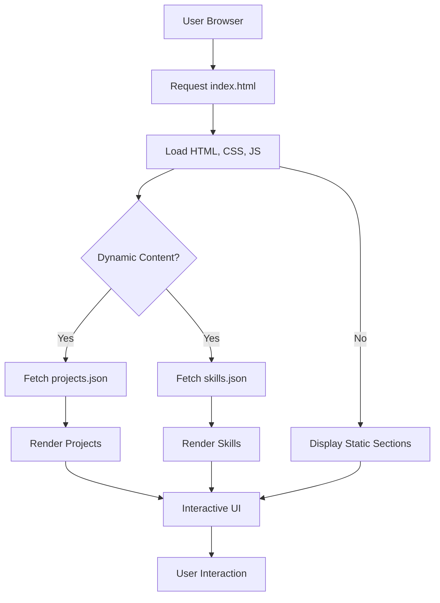

# 🚀 Dynamic Portfolio Website

<p align="center"></p>

## Short Description
Unleash your professional presence with this dynamic and highly responsive personal portfolio website! Engineered for impact, it serves as a powerful platform to showcase your skills, highlight your projects, and chronicle your professional journey. Built with cutting-edge front-end technologies, this repository provides a sleek, modern, and engaging experience for anyone looking to present their work to the world.

## ✨ Key Features
*   **Interactive Project Showcase:** Present your best work with dedicated sections for each project, leveraging `projects/projects.json` for easy content management.
*   **Comprehensive Experience Timeline:** Detail your professional journey and academic background through a dedicated `experience` section.
*   **Dynamic Skills Display:** Effortlessly manage and display your technical proficiencies using `skills.json`.
*   **Responsive & Modern Design:** Crafted with `assests/css/style.css` and a mobile-first approach, ensuring a seamless experience across all devices.
*   **Engaging Visual Effects:** Incorporates `particles.min.js` and other JavaScript enhancements for a visually stunning and interactive user interface.
*   **Downloadable Resume:** Provides direct access to your professional `assests/resume.pdf` for recruiters and collaborators.
*   **Custom 404 Error Page:** A uniquely designed `404.html` with dedicated styling and scripting ensures a polished user experience, even when things go awry.

## Who is this for?
This project is ideal for **software developers, designers, students, and professionals** seeking a robust, attractive, and easily deployable online portfolio. It empowers you to make a strong first impression on potential employers, clients, or collaborators by presenting your capabilities and achievements in a compelling, organized manner.

## Technology Stack & Architecture
This portfolio website is a testament to modern front-end web development, built upon a solid foundation of core web technologies:

*   **HTML5:** For structuring the semantic content of the portfolio.
*   **CSS3:** Utilized for styling, responsiveness, and creating a visually appealing aesthetic across the site.
*   **JavaScript:** Powers the dynamic elements, interactivity, and custom logic, including integrations with libraries like `particles.js` for animated backgrounds.
*   **JSON:** Used as a lightweight data interchange format for managing and rendering project details (`projects/projects.json`) and skill sets (`skills.json`), making content updates straightforward.

The architecture is a **client-side rendered static application**, meaning all content and logic are executed directly in the user's browser, providing fast load times and a secure, server-less deployment model.

## 📊 Architecture & Database Schema
This project is a static web application, primarily client-side rendered, and does not utilize a traditional backend database. Its architecture focuses on the efficient delivery and dynamic presentation of content within the browser.



## ⚡ Quick Start Guide
Getting this sleek portfolio up and running on your local machine is incredibly simple.

1.  **Clone the repository:**
    ```bash
    git clone https://github.com/grewal16/portfolio_website.git
    ```
2.  **Navigate to the project directory:**
    ```bash
    cd portfolio_website
    ```
3.  **Open `index.html`:**
    Simply open the `index.html` file in your preferred web browser to view the portfolio. For a live development experience, you can use a local server (e.g., Live Server extension in VS Code).

## 📜 License
This project is licensed under the MIT License. See the `LICENSE` file for more details.